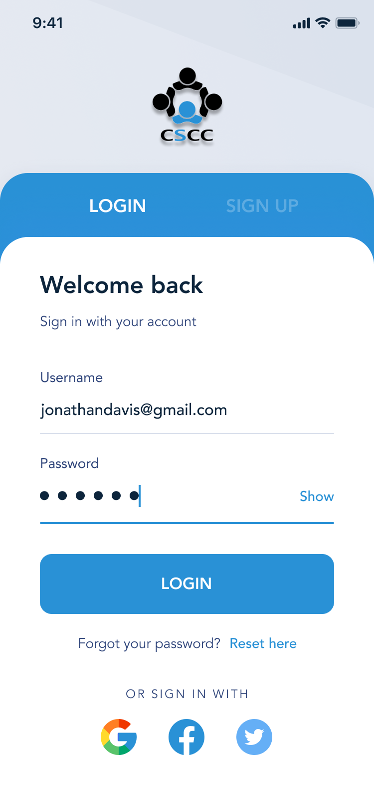
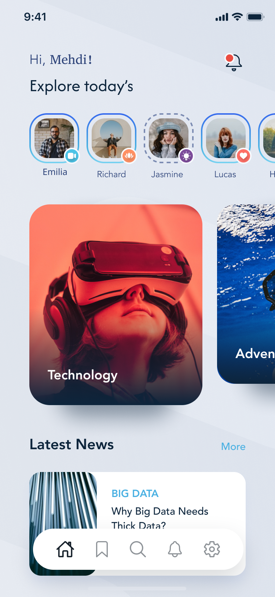
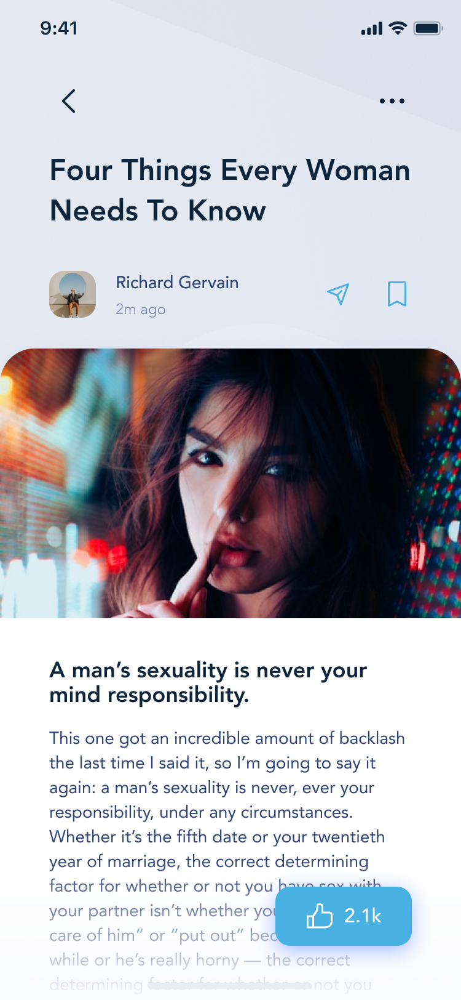
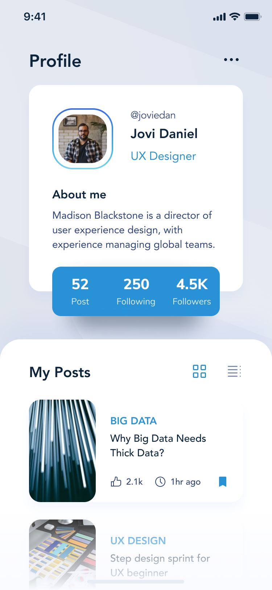

# Blog Mobile App

A modern mobile application built with Flutter that provides a personalized blogging and content exploration experience.


## Features

- **Personalized Welcome**: Custom greeting for each user
- **Story Circles**: Interactive user stories with status indicators (video, meditation, premium content)

## App Screenshots

<div align="center">
  
  
  
  
</div>

## Latest Features
- News feed with categorized articles
- Big Data insights and analysis
- Bottom navigation with Home, Bookmarks, Search, Notifications, and Settings

## UI Components
- Modern, clean interface with rounded corners
- Story circle avatars with status indicators
- Category cards with engaging imagery
- News article previews
- Notification system

## Getting Started

### Prerequisites
- Flutter (latest version)
- Dart SDK
- Android Studio / Xcode for mobile development

### Installation

1. Clone the repository
```bash
git clone [repository-url]
```

2. Install dependencies
```bash
flutter pub get
```

3. Run the app
```bash
flutter run
```

## Design Credits
UI/UX inspiration from modern social media and content platforms.

## License
This project is licensed under the MIT License - see the LICENSE file for details.


